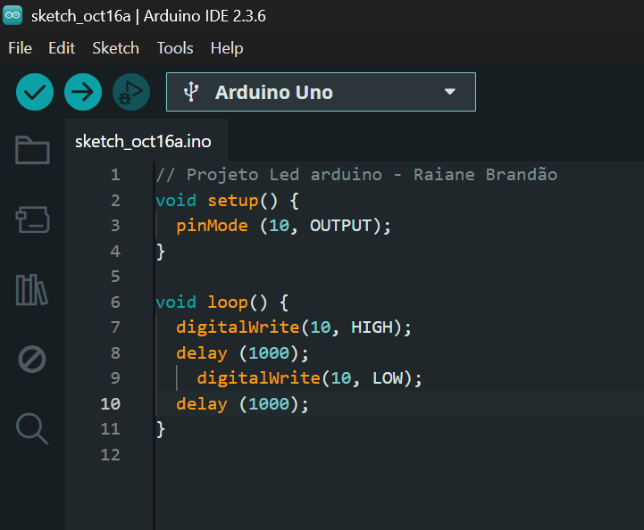
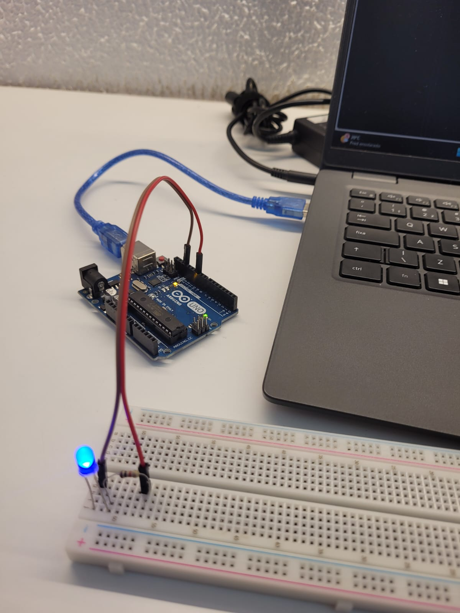
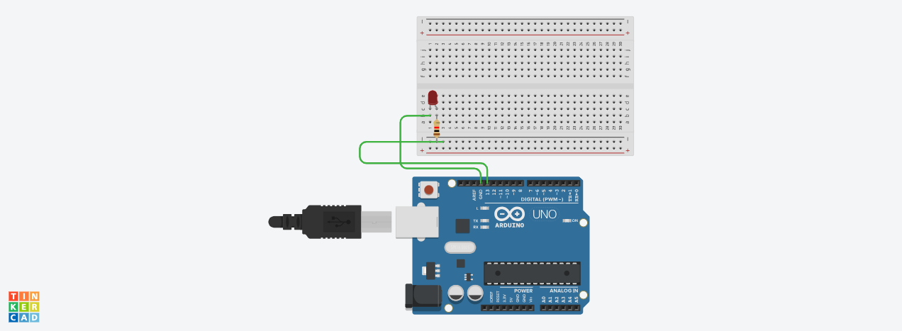

# Parte 1: Blink LED Interno

**Nome:** Raiane Araujo Brandão  
**Turma:** 16  
**Grupo:** 4

---

## Objetivo

Fazer o LED interno do Arduino:

- Ficar **aceso** por um tempo `X`.  
- **Apagar** e aguardar `Y` segundos.  
- **Voltar a acender**, em um loop contínuo — criando o efeito de uma **“luz piscando”**.

---

## Entrega Parte 1

**Local de entrega:**  
Seu repositório **GitHub pessoal** (usando a conta com e-mail Inteli).

Você deverá inserir:

- Screenshot da sua tela mostrando a IDE e o código.  
- Fotografia do Arduino conectado ao computador, com o LED aceso.  
- (Opcional) Vídeo evidenciando o funcionamento.

---

## Evidências

### Screenshot do código na IDE

### Fotografia do Arduino em funcionamento

### Vídeo de Demonstração
[Assista ao vídeo localmente](assets/arduinovideo.mp4)

---

## Parte 2: Simulando Blink Externo

Nessa Parte 2, você deverá fazer uma **simulação no TinkerCad** com uma montagem do pisca-pisca utilizando o **Arduino Uno**.  
Ao clicar em *Play* no TinkerCad, o projeto deve executar sem erros uma rotina que simula um pisca-pisca com qualquer cadência.

O projeto deve conter:
- Um **protoboard**  
- **Ligações elétricas** corretas  
- **LED externo (OFF_BOARD)**  
- **Resistor**  
- **Arduino Uno**

---

## Entrega Parte 2

1. Envie o **link do seu projeto no TinkerCad** pela **Adalove**.  
2. Obtenha o **código gerado no TinkerCad**, publique em seu **repositório pessoal do GitHub** e envie esse link no card correspondente.

---

## Evidência

### Simulação no TinkerCad

